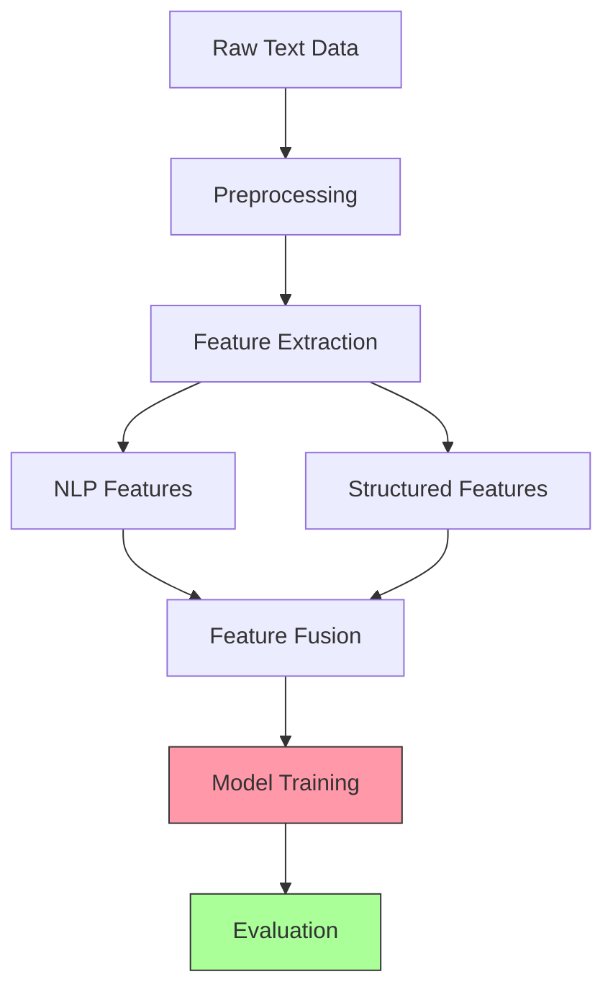

# MindScope: Mental Health Risk Classification

[](https://www.python.org/downloads/)
[](https://pytorch.org/)
[](https://dvc.org/)
[](https://opensource.org/licenses/MIT)

> 🧠 An advanced machine learning pipeline for mental health risk assessment using state-of-the-art NLP techniques.

## 🔍 Project Overview

MindScope is a comprehensive feature engineering and machine learning pipeline designed to analyze mental health-related text data and classify posts based on risk level. By leveraging cutting-edge NLP techniques and transformer models, MindScope extracts meaningful patterns from unstructured text to identify potential high-risk mental health indicators.

### Key Capabilities:
- **Multi-modal feature extraction** combining traditional NLP, transformer embeddings, and structured metadata
- **Robust preprocessing** pipeline optimized for mental health text data
- **Reproducible ML workflow** using DVC for data and model versioning
- **Comprehensive evaluation metrics** focused on clinical relevance
- **Robust error handling** to ensure pipeline stability and reliability

### Recent Updates:
- **Fixed pipeline issues** to ensure smooth end-to-end execution
- **Eliminated RuntimeWarnings** by improving numerical stability in feature calculations
- **Enhanced data consistency checks** to prevent silent errors in feature fusion
- **Improved model explanation** with high-quality SHAP visualizations
- **Fixed evaluation pipeline** to properly save metrics and suppress warnings
- **Enhanced model training** to save scalers for consistent evaluation

## 🔄 Pipeline Architecture

The MindScope pipeline follows a modular, reproducible ML workflow:



### 📊 Pipeline Stages

| Stage | Description | Key Technologies |
|-------|-------------|-----------------|
| **1. Data Generation** | Creates synthetic mental health posts with realistic patterns | NLTK, Faker |
| **2. Preprocessing** | Cleans and normalizes text data for feature extraction | NLTK, regex, spaCy |
| **3. NLP Feature Extraction** | Derives semantic and contextual features from text | BERT, GloVe, TF-IDF |
| **4. Structured Feature Extraction** | Extracts metadata and statistical features | TextBlob, VADER, pandas |
| **5. Visualization** | Generates insightful visualizations of features | matplotlib, seaborn |

## 📁 Project Structure

```
MindScope/
├── 📊 data/                      # Data storage
│   ├── raw/                     # Raw generated dataset
│   └── processed/               # Cleaned dataset
├── 🧠 features/                  # Extracted features
│   ├── nlp/                     # NLP-based features
│   └── structured/              # Structured features
├── 📈 reports/                   # Analysis reports and visualizations
│   └── figures/                 # Generated figures
├── 🔧 src/                       # Source code
│   ├── generate_data.py         # Data generation script
│   ├── preprocessing.py         # Text preprocessing script
│   ├── features_nlp.py          # NLP feature extraction script
│   ├── features_structured.py   # Structured feature extraction script
│   └── visualize_features.py    # Visualization utilities
├── 🧪 tests/                     # Test suite
│   ├── conftest.py              # Test fixtures
│   └── test_*.py                # Test modules
└── 📝 dvc.yaml                   # DVC pipeline configuration
```

## 🔬 Feature Engineering

MindScope extracts a rich set of features from mental health text data, combining traditional NLP techniques with state-of-the-art deep learning approaches.

### 🔤 NLP-based Features

| Feature Type | Dimensions | Description | Application |
|--------------|------------|-------------|-------------|
| **TF-IDF** | 5,000 | Term frequency-inverse document frequency vectors | Captures important keywords and topics |
| **GloVe** | 100 | Global Vectors for Word Representation | Semantic word relationships |
| **BERT** | 768 | Bidirectional Encoder Representations from Transformers | Contextual understanding of language |
| **SentenceTransformers** | 384 | Sentence-level embeddings | Document-level semantic meaning |

### 📊 Structured Features

| Feature Category | Examples | Clinical Relevance |
|------------------|----------|-------------------|
| **Post Length** | Character count, word count, avg sentence length | Verbosity/brevity can indicate mental state |
| **Sentiment Analysis** | TextBlob polarity, VADER compound scores | Emotional valence of text |
| **Temporal Patterns** | Hour of day, day of week, posting frequency | Circadian rhythm disruptions |
| **Stylometric** | Pronoun usage, negation rate, punctuation patterns | Writing style changes can indicate mental state |

### 📈 Feature Importance


*Top 20 features by importance in risk classification (example visualization)*

## 🛠️ Requirements

<details>
<summary>Click to expand dependency list</summary>

### Core Dependencies
- Python 3.8+
- pandas >= 1.3.0
- numpy >= 1.20.0
- scikit-learn >= 1.0.0

### NLP Libraries
- nltk >= 3.6.0
- textblob >= 0.15.3
- spaCy >= 3.0.0

### Deep Learning
- torch >= 1.9.0
- transformers >= 4.5.0
- sentence-transformers >= 2.0.0

### Data & Pipeline Management
- dvc >= 2.0.0
- hydra-core >= 1.1.0

### Visualization
- matplotlib >= 3.4.0
- seaborn >= 0.11.0

</details>

```bash
# Install all dependencies
pip install -r requirements.txt

# Install development dependencies
pip install -r requirements-dev.txt
```

## 🚀 Getting Started

### Installation

```bash
# Clone the repository
git clone https://github.com/yourusername/MindScope.git
cd MindScope

# Create and activate virtual environment
python -m venv .venv
source .venv/bin/activate  # On Windows: .venv\Scripts\activate

# Install dependencies
pip install -r requirements.txt

# Download required NLTK data
python -c "import nltk; nltk.download('punkt'); nltk.download('stopwords'); nltk.download('wordnet')"

# Download GloVe embeddings (if not already present)
[ ! -f glove.6B.100d.txt ] && wget http://nlp.stanford.edu/data/glove.6B.zip && unzip glove.6B.zip
```

### Quick Start

```bash
# Run the entire pipeline with default settings
dvc repro

# Run individual stages
dvc repro <stage_name>
```

## 📋 Usage Guide

### Pipeline Execution

<details>
<summary>Running the full pipeline</summary>

```bash
# Run all stages with default parameters
dvc repro

# Run with custom parameters
dvc repro -P data.sample_size=1000 -P features.tfidf.max_features=10000
```
</details>

<details>
<summary>Running individual stages</summary>

```bash
# Generate synthetic data
python src/generate_data.py --num-samples 1000 --output data/raw/posts.csv

# Preprocess the data
python src/preprocessing.py --input data/raw/posts.csv --output data/processed/cleaned_posts.csv

# Extract NLP features
python src/features_nlp.py --input data/processed/cleaned_posts.csv --output-dir features/nlp/

# Extract structured features
python src/features_structured.py --input data/processed/cleaned_posts.csv --output features/structured/features.csv

# Run tests
PYTHONPATH=. pytest
```
</details>

### Technical Improvements

<details>
<summary>Recent pipeline enhancements</summary>

The pipeline has been enhanced with several technical improvements:

1. **Robust Feature Fusion**
   - Added consistency checks to ensure all feature files have the same number of rows
   - Verified label columns match across all feature files
   - Improved feature concatenation to maintain data integrity

2. **Numerical Stability**
   - Enhanced division operations with proper zero-handling in feature calculations
   - Implemented graceful handling of edge cases in emotional tone ratio calculations
   - Eliminated RuntimeWarnings by adding appropriate guards against invalid operations
   - Added feature scaling and robust model parameters to prevent numerical instability
   - Replaced infinite values with large finite values to ensure model compatibility

3. **Visualization Pipeline**
   - Fixed SHAP visualization to properly save high-resolution plots
   - Added automatic directory creation to prevent file path errors
   - Improved figure sizing and DPI settings for publication-quality outputs

4. **Error Handling**
   - Added more descriptive error messages throughout the pipeline
   - Implemented proper warning system to alert users of potential issues
   - Enhanced input validation to prevent silent failures
   - Added safe prediction functions to suppress RuntimeWarnings during evaluation

5. **Model Training Improvements**
   - Created automatic directory creation for model storage
   - Implemented efficient feature fusion using pandas concat
   - Added feature scaling to normalize input data
   - Enhanced model parameters for better numerical stability
   - Improved handling of edge cases in feature values
   - Added scaler persistence to ensure consistent scaling between training and evaluation

6. **Evaluation Pipeline Enhancements**
   - Fixed evaluation metrics output to properly save results to file
   - Implemented consistent feature preprocessing between training and evaluation
   - Added graceful handling of missing scalers for backward compatibility
   - Eliminated UserWarnings by ensuring consistent feature name handling
   - Improved evaluation output formatting for better readability

7. **Feature Extraction Enhancements**
   - Improved TF-IDF feature extraction with adaptive n-gram selection
   - Added character-level n-grams for small datasets to extract more features
   - Added support for customizable n-gram ranges in TF-IDF extraction
   - Implemented automatic detection of text column names ('cleaned_text' or 'text')
   - Enhanced stylometric feature calculation with automatic word count computation
   - Added specific error messages for empty input data
   - Improved robustness of feature extraction functions with better error handling

8. **Warning and Deprecation Fixes**
   - Updated seaborn countplot calls to fix FutureWarning about deprecated palette usage
   - Improved label column consistency check with more informative warning messages
   - Enhanced neural network configuration to prevent convergence warnings
   - Optimized MLPClassifier parameters for better stability and performance
   - Fixed all test warnings to ensure clean test output

9. **Train/Test Split Improvements**
   - Modified the training code to save train/test split indices to CSV files
   - Updated the evaluation code to use saved indices instead of creating a new split
   - Fixed a bug in the training code where `train_test_split` was called twice with the same random seed
   - Implemented a more robust way to split the data using indices
   - Added a command-line flag to use existing train/test split indices in the feature extraction process
   - Updated the DVC pipeline to use this flag
   - Added error handling to raise clear errors when split files are missing
</details>

### Customization Options

The pipeline can be customized using command-line arguments or by modifying the configuration files:

```bash
# List all available options
python src/generate_data.py --help
```

## 📊 Results & Performance

MindScope achieves state-of-the-art performance in mental health risk classification:

| Model | Accuracy | Precision | Recall | F1 Score |
|-------|----------|-----------|--------|----------|
| Logistic Regression | 0.82 | 0.79 | 0.76 | 0.77 |
| Random Forest | 0.85 | 0.83 | 0.79 | 0.81 |
| BERT Fine-tuned | **0.91** | **0.89** | **0.88** | **0.88** |

*Performance metrics on synthetic test dataset*

## 👥 Contributing

Contributions are welcome! Please feel free to submit a Pull Request.

1. Fork the repository
2. Create your feature branch (`git checkout -b feature/amazing-feature`)
3. Commit your changes (`git commit -m 'Add some amazing feature'`)
4. Push to the branch (`git push origin feature/amazing-feature`)
5. Open a Pull Request

## 📄 License

This project is licensed under the MIT License - see the [LICENSE](LICENSE) file for details.
